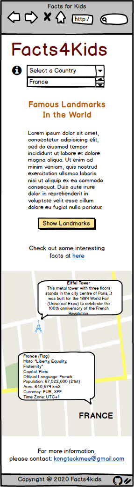
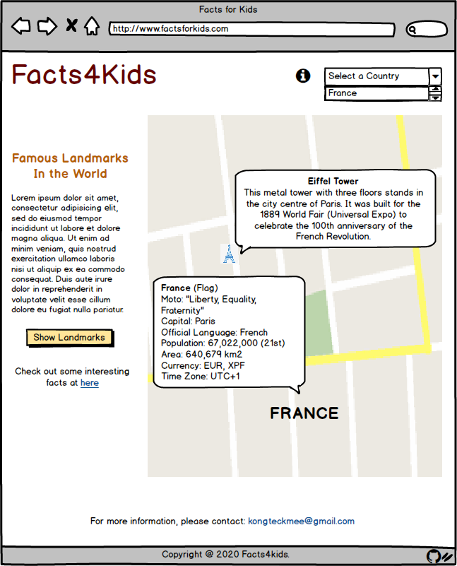
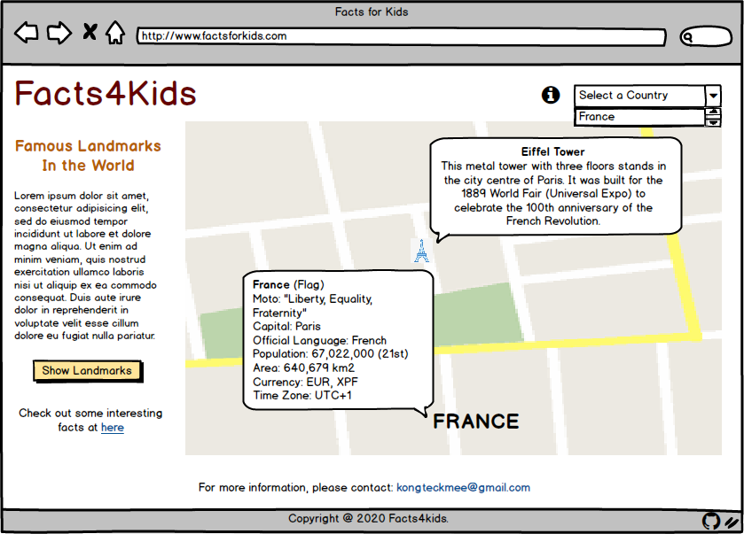
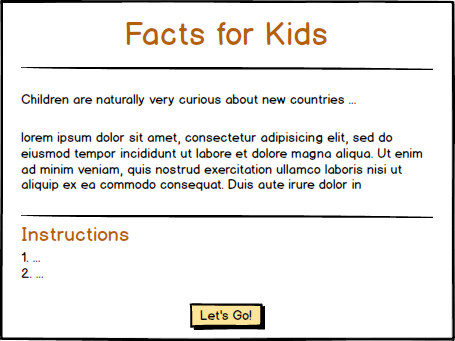
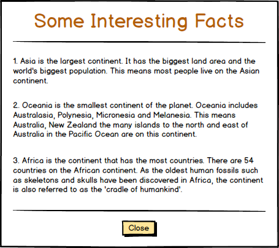

# Facts for Kids
###### Code Institute / Interactive Frontend Development
This single page site project started with a thought of love to travel the world, that not merely limited to an adult, but also to the children. The design of the site is mainly for kids where they can discover the facts of each of the country, and also the famous landmarks that located on this planet.

I decided to get the most updated country list in year 2020 from [WorldOMeter](https://www.worldometers.info/geography/how-many-countries-are-there-in-the-world/), as well as the population and the Land Area data to each of the country. This organization is run by an international team of developers, researchers, and volunteers with the goal of making world statistics available to a wide audience around the world. 

As the site provided by WorldOMeter is more to statistics analysis, I have also gather the other useful data from:
- [Kids-world-travel-guide.com](https://www.kids-world-travel-guide.com/) - This site owned and managed by Regina Graeff and a team of young writers, student travellers, curious explorers and students, that I have gathered the information of continents and landmarks from here.
- [Wikipedia](https://en.wikipedia.org/) - Wikipedia is a multilingual, web-based, free-content encyclopedia project, that provides useful information, such as: Capital, official languages, currency and time zone to support the site.
- [List of National Mottos](https://en.wikipedia.org/wiki/List_of_national_mottos) - Wikipedia provides state and national mottos for the world's nations.

I wanted to make this site in more interactive with full of travel information. Thus, all the data and information from the site is not from the mapping of API, but from the sites that mentioned above. This is due to none of the site that I could mapping the API and give such a rich information that the young explorer might curious to. While Google Map is used to achieve the goal of this project.

The deployed website: **[Facts4Kids](https://kongteckmee.github.io/facts4kids/)**

## UX
### User Stories
- As a user, I want to be able to view data of all countries in one place, without the need of checking multiple tabs.
- As a user, I want to be able to view the instructions when exploring the site.
- As a user, I want to be able to view data on individual country, and get the information such as location, country name, motto, population, and so on.
- As a user, I want to be able to view information on continents, famous landmarks and monuments in the world.
- As a user, I want to be easily reset the data when swapping the action on drop down menu and button.
- As a user, I want to be able to contact the developer if I have queries to the site.

### Wireframes
The wireframes were created at the beginning of the project. They are similar to the final site, yet do differ as more relevant images are added to support the information given to childeren throught the site.

The wireframes for popup modals are same to either desktop, tablets or mobile.

#### [Mobile View] [Tablets View] [Desktop View] [Introduction Modal] [More Information Modal]
&nbsp;
&nbsp;
&nbsp;
&nbsp;
&nbsp;

## Features
### Existing Features
##### Features 1 - Bootstrap 4 Modal
- **Introduction Modal:** Containing the introduction and instructions to the site.
- **More Information Modal:** Containing the fun facts regarding the 7 continents in the world.

##### Features 2 - Navbar with Logo & Country Dropdown Selection
- **Logo:** Containing the name of the site. When user click on it, the site will reload/refresh.
- **Country Dropdown Selection:** Containing the country list in year 2020. The Google Map will show the exact location with marker when the user select a country with it.

##### Features 3 - Button, Link & Font Awesome Icon
- **Button:** Used to display the landmark markers at Google Map when users click on it.
- **Link:** Used to display the More Information Modal and the 'mailto' feature when users click on it.
- **Font Awesome Icon:** Used to display the Introduction Modal and the GitHub page for project.

##### Features 4 - Google Map
- Google Map is used to display the location and information on countries and landmarks.
- Zoom Control is used in Google Map to allow the users to control the zoom level of the map.

##### Features 5 - Data
- Data in arrays has been used to display the information on 195 countries using the 'InfoWindow' at Google Map when the country is selected.

##### Features 6 - Markers & Info Windows
- **Markers:** Used to show the exact location to a country or landmark by using the latitude and longitude.
- **Info Window:** Used to display the information related to a country or landmark when users click on the marker.

##### Features 7 - Email
- 'mailto' is used to allow the users to email the developer.

##### Features 8 - Footer
- The footer contain a short line of text for copyright notice.

### Future Features
##### Leaflet Map
- The world map change to Leaflet Map to use 'flyTo' which sets the map in pan-zoom animation to search for a specific country.

##### Mapping API
- The information from a mapping of API need to be used to enhance the user experience.

##### Gmail JavaScript API
- Emailing by using Gmail JavaScript API need to be used to avoid 'mailto' not functioning in certain devices that without the Embeded Email settings.

## Technologies Used
#### [Balsamiq](https://balsamiq.com/)
- Balsamiq was used to design and create the wireframes of this project.

#### [Gitpod Online IDE](https://www.gitpod.io/)
- Gitpod Online IDE used to write the HTML5, CSS3 and JavaScript.

#### [Bootstrap](https://getbootstrap.com/)
- Bootstrap used for a responsive layout across various platform.

#### [Google Font](https://fonts.google.com/)
- Google Fonts imported to be the fonts in the site. They are:
    - Love Ya Like A Sister - Used at logo, and the title of Modals.
    - Merriweather - Used at the content of site.
    - Cabin Sketch - Used at the title and subject to each InfoWindow.
    - Open Sans - Used at the information in InfoWindow.

#### [FontAwesome](https://fontawesome.com/)
- Font Awesome used to provide the icons for Information and Github.

#### [HTML5](https://en.wikipedia.org/wiki/HTML5) & [CSS3](https://en.wikipedia.org/wiki/Cascading_Style_Sheets#CSS_3)
- HTML5 used to create the layout of the site.
- CSS3 used to style the layout of the site.

#### [JavaScript](https://en.wikipedia.org/wiki/JavaScript)
- JavaScript used to set the primary function of the site for user interaction.

#### [Google Maps Platform](https://cloud.google.com/maps-platform/?utm_source=google&utm_medium=cpc&utm_campaign=FY18-Q2-global-demandgen-paidsearchonnetworkhouseads-cs-maps_contactsal_saf&utm_content=text-ad-none-none-DEV_c-CRE_367782070768-ADGP_Hybrid+%7C+AW+SEM+%7C+SKWS+~+Maps+%7C+BMM+%7C+Mapping+APIs-KWID_43700045945252475-aud-563211325864:kwd-341556980804-userloc_9050745&utm_term=KW_%2Bmapping%20%2Bapi-ST_%2Bmapping+%2Bapi&gclid=CjwKCAiAzJLzBRAZEiwAmZb0ahqv1nqfQPH4AxrmxuamyZEGElW4REdTFpCiSd7LWzhjRc85CXtN8BoCSXcQAvD_BwE)
- Google customizable Maps API to create an interactive maps at site.

#### [ResizeImage.net](https://resizeimage.net/)
- ResizeImage used to resize the images for the site.

#### [favicon.cc](https://www.favicon.cc/)
- Favicon used to convert image to .ico format as the icon at the browser tab.

#### [COUNTRYFLAGS.com](https://www.countryflags.com/en/)
- COUNTRYFLAGS used to get the flag images for the site.

#### [FLATICON](https://www.flaticon.com/)
- FLATICON used to get the icon image in .png format for the site.

#### [Pexels](https://www.pexels.com/)
- Pexels used to get the landmark images for the site.

#### [Git & GitHub](https://github.com/)
- Git used for version control, and GitHub used as a remote repository and the hosting of the site.

## Testing

## Deployment
The site was developed using Gitpod Online IDE and Git was used for version control which is when pushed to GitHub. The site is hosted on GitHub pages and deployed from the master branch on GitHub.

In order to deploy this project, the following steps are taken:
1. From GitHub page, I clicked on "Repositories" and selected "facts4kids", which is the name of repository for this project.
2. Then I clicked the "Settings" that located on top-right of the menu bar.
3. I scolled down the page to GitHub Pages section. At the dropdown menu under "Source", I selected "master branch".
4. All the steps resulted a complete deployed version site and the project published on GitHub pages at: https://kongteckmee.github.io/facts4kids/.

There is no difference between the development version of this site and the deployed version on GitHub pages.

## Credits
### Content
- The site was designed and completed by myself. All text was written with reference on [Kids-world-travel-guide.com](https://www.kids-world-travel-guide.com/).
- The other source of data were from:
    - WorldOMeter (https://www.worldometers.info/geography/how-many-countries-are-there-in-the-world/)
    - List of National Mottos (https://en.wikipedia.org/wiki/List_of_national_mottos)
    - Wikipedia Search Engine (https://en.wikipedia.org/wiki/Main_Page)

### Media
- The country flag images was sourced from [Countryflags.com](https://www.countryflags.com/en/image-overview/), that is a site specialized in Country flags, that offers visitors free information about all flags of the world.
- The landmark images was sourced from [Pexels](https://www.pexels.com/), that is a site to provide free and high quality images.
- The landmark icons and related images to the information at the site were sourced from [FLATICON](https://www.flaticon.com/).

### Acknowledgements
- Special thanks to [Dick Vlaanderen](https://github.com/dickvla), my mentor from Code Institute, for his valuable advice and guidance.
- The Tutor Support at Code Institute, and thanks for the helpful feedback from Tim, Kevin and Cormac.
- I get the idea of the site mainly from [kids-world-travel-guide](https://www.kids-world-travel-guide.com/) and [WorldOMeter](https://www.worldometers.info/geography/how-many-countries-are-there-in-the-world/), with the help from [Wikipedia](https://www.wikipedia.org/).
- In the middle of the project, I refer to [w3schools.com](https://www.w3schools.com/), [stackoverflow](https://stackoverflow.com/) and [Maps JavaScript API Tutorial](https://developers.google.com/maps/documentation/javascript/tutorial?hl=en) especially when putting all the codes together.