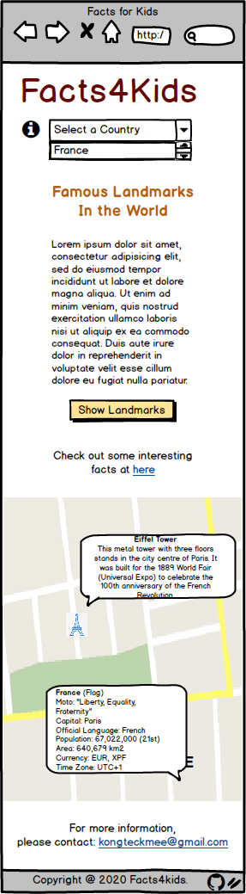
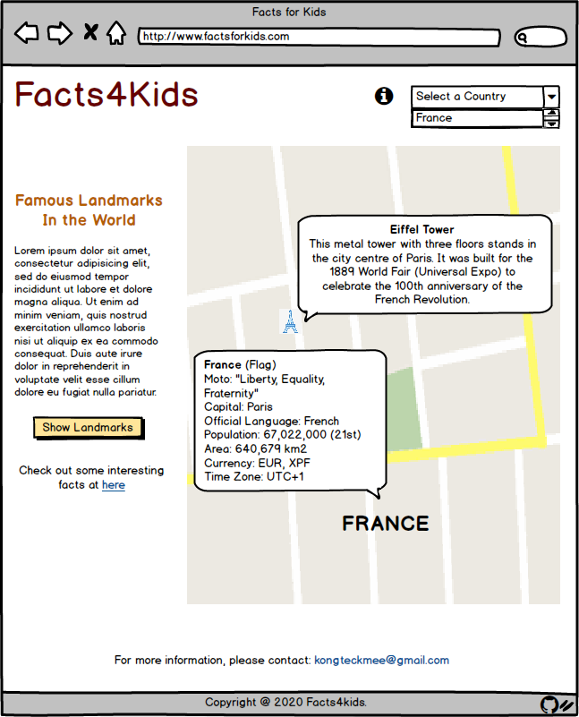
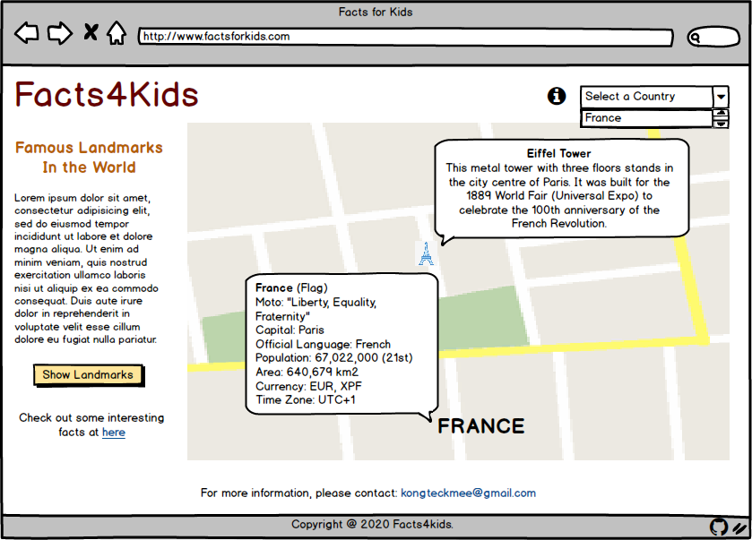
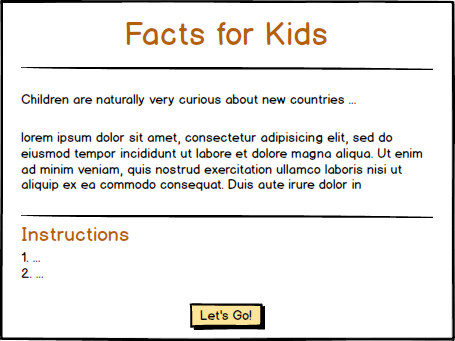
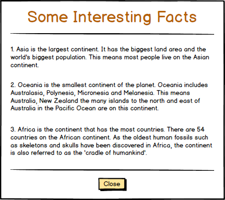

# Facts for Kids
###### Code Institute / Interactive Frontend Development
This single page site project started with a thought of love to travel the world, that not merely limited to an adult, but also to the children. The design of the site is mainly for kids where they can discover the facts of each of the country, and also the famous landmarks that located on this planet.

I decided to get the most updated country list in year 2020 from [WorldOMeter](https://www.worldometers.info/geography/how-many-countries-are-there-in-the-world/), as well as the population and the Land Area data to each of the country. This organization is run by an international team of developers, researchers, and volunteers with the goal of making world statistics available to a wide audience around the world. 

As the site provided by WorldOMeter is more to statistics analysis, I have also gather the other useful data from:
- [Countryflags.com](https://www.countryflags.com/en/image-overview/) - Specialized in Country flags, that offers visitors free information about all flags of the world.
- [Wikipedia](https://en.wikipedia.org/) - Wikipedia is a multilingual, web-based, free-content encyclopedia project, that provides useful information, such as: Capital, official languages, currency and time zone to support the site.
- [List of National Mottos](https://en.wikipedia.org/wiki/List_of_national_mottos) - Wikipedia provides state and national mottos for the world's nations.
- [Kids-world-travel-guide.com](https://www.kids-world-travel-guide.com/) - This site owned and managed by Regina Graeff and a team of young writers, student travellers, curious explorers and students, that I have gathered the information of continents and landmarks from here.

I wanted to make this site in more interactive with full of travel information. Thus, all the data and information from the site is not from the mapping of API, but from the sites that mentioned above. This is due to none of the site that I could mapping the API and give such a rich information that the young explorer might curious to. While Google Map is used to achieve the goal of this project.

The deployed website: **[Facts4Kids](https://kongteckmee.github.io/facts4kids/)**

## UX
### User Stories
- As a user, I want to be able to view data of all countries in one place, without the need of checking multiple tabs.
- As a user, I want to be able to view the instructions when exploring the site.
- As a user, I want to be able to view data on individual country, and get the information such as location, country name, motto, population, and so on.
- As a user, I want to be able to view information on continents, famous landmarks and monuments in the world.
- As a user, I want to be easily reset the data when swapping the action on drop down menu and button.
- As a user, I want to be able to contact the developer if I have queries to the site.

### Wireframes
The wireframes were created at the beginning of the project. They are similar to the final site, yet do differ as more relevant images are added to support the information given to childeren throught the site.

The wireframes for popup modals are same to either desktop, tablets or mobile.

#### [Mobile View] [Tablets View] [Desktop View] [Introduction Modal] [More Information Modal]
&nbsp;
&nbsp;
&nbsp;
&nbsp;
&nbsp;

## Features
### Existing Features
##### Features 1 - Bootstrap 4 Modal
- **Introduction Modal:** Containing the introduction and instructions to the site.
- **More Information Modal:** Containing the fun facts regarding the 7 continents in the world.

##### Features 2 - Navbar with Logo & Country Dropdown Selection
- **Logo:** Containing the name of the site. When user click on it, the site will reload/refresh.
- **Country Dropdown Selection:** Containing the country list in year 2020. The Google Map will show the exact location with marker when the user select a country with it.

##### Features 3 - Button, Link & Font Awesome Icon
- **Button:** Used to display the landmark markers at Google Map when users click on it.
- **Link:** Used to display the More Information Modal and the 'mailto' feature when users click on it.
- **Font Awesome Icon:** Used to display the Introduction Modal and the GitHub page for project.

##### Features 4 - Google Map
- Google Map is used to display the location and information on countries and landmarks.
- Zoom Control is used in Google Map to allow the users to control the zoom level of the map.

##### Features 5 - Data
- Data in arrays has been used to display the information on 195 countries using the 'InfoWindow' at Google Map when the country is selected.

##### Features 6 - Markers & Info Windows
- **Markers:** Used to show the exact location to a country or landmark by using the latitude and longitude.
- **Info Window:** Used to display the information related to a country or landmark when users click on the marker.

##### Features 7 - Email
- 'mailto' is used to allow the users to email the developer.

##### Features 8 - Footer
- The footer contain a short line of text for copyright notice.

### Future Features
##### Leaflet Map
- The world map change to Leaflet Map to use 'flyTo' which sets the map in pan-zoom animation to search for a specific country.

##### Mapping API
- The information from a mapping of API need to be used to enhance the user experience.

##### Gmail JavaScript API
- Emailing by using Gmail JavaScript API need to be used to avoid 'mailto' not functioning in certain devices that without the Embeded Email settings.

## Technologies Used